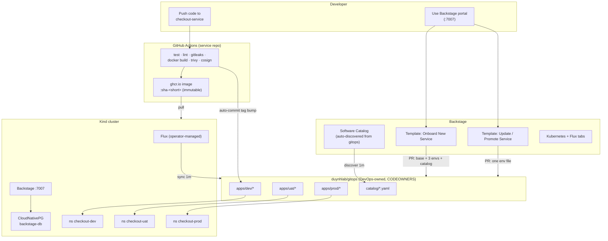
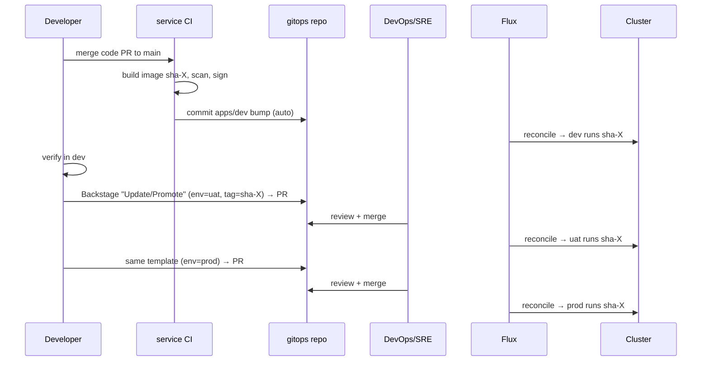

# Developer Platform (Backstage)

Internal Developer Platform for the `duynhlab` ecosystem, built with
[Backstage](https://backstage.io). Developers onboard, update and promote
services themselves through software templates; **DevOps/SRE only review and
approve pull requests**. Flux applies whatever is on the gitops repo's `main`.

## Architecture



**Review gate:** every PR to `duynhlab/gitops` requires DevOps/SRE approval
(CODEOWNERS + branch protection). The only exception is the CI dev-deploy lane,
which commits image-tag bumps to `apps/dev` directly.

## Delivery & promotion flow



See [docs/environments.md](docs/environments.md) for the environment model and
[docs/onboarding.md](docs/onboarding.md) for the step-by-step guide.

## Prerequisites

- **Node.js** 22 or 24, **Yarn** 4.4.1 (via `.yarnrc.yml`), **Docker**
- **Kind**, **kubectl**, **Helm v3+**, **helmfile v1+**
- **gh** CLI authenticated with an account that can open PRs against `duynhlab/gitops`

## Quick Start (local development)

```bash
export GITHUB_TOKEN=$(gh auth token)
corepack enable && corepack yarn install
corepack yarn start          # frontend :3000, backend :7007, SQLite in-memory
```

## Deploy to Kind

The whole stack — Flux Operator + FluxInstance (syncing
[duynhlab/gitops](https://github.com/duynhlab/gitops)), CloudNativePG, the
Backstage database (CNPG `Cluster`) and Backstage itself — is declared in
[`deploy/helmfile.yaml.gotmpl`](deploy/helmfile.yaml.gotmpl):

```bash
./deploy/setup.sh
# Open http://localhost:7007 (Kind maps NodePort 30007 → host 7007)
```

See [deploy/README.md](deploy/README.md) for details.

## Installed Plugins

| Plugin | Purpose |
|--------|---------|
| Software Catalog | Service registry — entities discovered from `duynhlab/gitops` `catalog/*.yaml` |
| Kubernetes | Pods/logs across all environments (label selector `app.kubernetes.io/name=<svc>`) |
| Flux (`@backstage-community/plugin-flux`) | HelmRelease status per env, Sync/Suspend |
| Scaffolder | `onboard-service`, `update-service` templates (PR-based self-service) |
| TechDocs, Search, Notifications | Docs, full-text search, signals |

## Project Structure

```
backstage/
├── app-config.yaml                 # Dev config (SQLite, localhost)
├── app-config.production.yaml      # In-cluster config (PostgreSQL, K8s, provider)
├── catalog/
│   ├── systems/ecommerce.yaml      # System entity
│   └── org/platform-team.yaml      # Group + User entities
├── templates/
│   ├── onboard-service/            # New service → PR (base + dev/uat/prod + catalog)
│   └── update-service/             # Update/promote one env → PR
├── packages/app/                   # Frontend (React)
├── packages/backend/               # Backend + Dockerfile
├── deploy/
│   ├── helmfile.yaml.gotmpl        # Full stack: flux, cnpg, backstage-db, backstage
│   ├── kind-config.yaml            # Kind cluster (NodePort 30007 → host 7007)
│   ├── setup.sh                    # One-command bootstrap
│   └── charts/                     # Local charts: backstage, backstage-db (CNPG)
└── docs/
    ├── onboarding.md               # Dev guide + DevOps review checklist
    └── environments.md             # dev/uat/prod model, promotion, rollback
```

## Configuration

| Variable | Required | Description |
|----------|----------|-------------|
| `GITHUB_TOKEN` | Yes | GitHub PAT with `repo` scope (scaffolder PRs + catalog discovery). `deploy/setup.sh` takes it from `gh auth token`. |
| `POSTGRES_*` | In-cluster | Injected by the `backstage` chart from the CNPG `backstage-db-app` secret. |

## Related Repositories

| Repository | Purpose |
|------------|---------|
| [duynhlab/gitops](https://github.com/duynhlab/gitops) | Source of truth for dev/uat/prod deployments — all self-service PRs land here |
| [duynhlab/checkout-service](https://github.com/duynhlab/checkout-service) | Checkout pricing API (Go) — the reference service on this platform |
| [duynhlab/helm-charts](https://github.com/duynhlab/helm-charts) | Shared `mop` service chart (OCI) |
| [duynhlab/gha-workflows](https://github.com/duynhlab/gha-workflows) | Reusable CI workflows (go-check, docker-build-go, trivy, cosign) |
