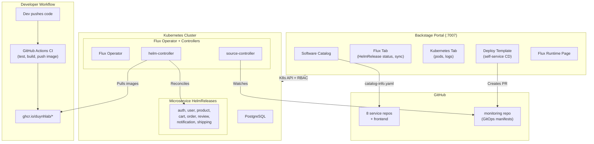
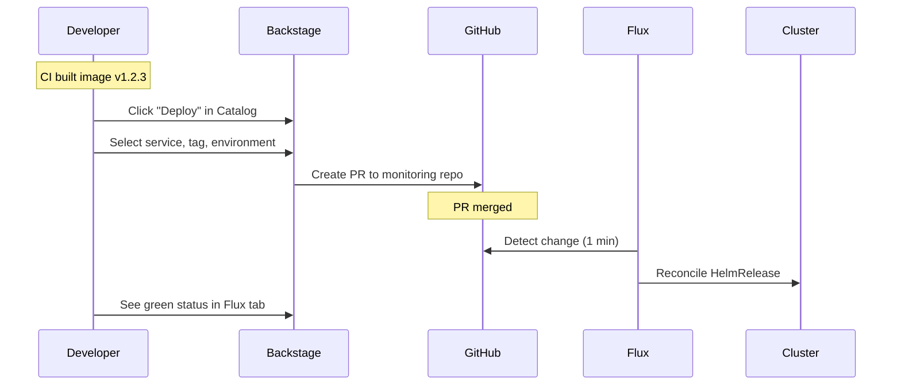

# Developer Platform (Backstage)

Internal Developer Platform built with [Backstage](https://backstage.io) for the `duynhlab` microservices ecosystem.

Provides a unified portal for service catalog, Flux GitOps-based deployment, Kubernetes monitoring, software templates, and TechDocs -- all driven by YAML configuration.

## Architecture



## Developer Deployment Flow



## Prerequisites

- **Node.js** 22 or 24
- **Yarn** 4.4.1 (included via `packageManager` in `package.json`)
- **Docker** (for building production image)
- **GitHub Personal Access Token** with `repo` scope

## Quick Start (Local Development)

```bash
# 1. Clone
git clone https://github.com/duynhlab/backstage.git
cd backstage

# 2. Set GitHub token
export GITHUB_TOKEN=ghp_your_token_here

# 3. Install dependencies
corepack enable
corepack yarn install

# 4. Start dev server (frontend :3000, backend :7007)
corepack yarn start
```

> **Linux Users**: If `yarn install` fails, prefix commands with `corepack` to ensure Yarn 4.x is used.

Open http://localhost:3000 in your browser. Local development uses **SQLite in-memory** database.

## Deploy to Kind Cluster (Production-like)

```bash
# One-command setup: Kind cluster + PostgreSQL + Flux Operator + Backstage
./deploy/kind/setup.sh
```

Or step by step -- see [deploy/README.md](deploy/README.md).

```bash
# Build and load Docker image
corepack yarn tsc
corepack yarn build:backend
corepack yarn build-image
kind load docker-image backstage --name backstage-dev

# Access Backstage
kubectl port-forward -n backstage svc/backstage 7007:7007
# Open http://localhost:7007
```

## Available Scripts

| Command | Description |
|---------|-------------|
| `corepack yarn start` | Start frontend + backend in development mode |
| `corepack yarn tsc` | TypeScript type check |
| `corepack yarn build:backend` | Build backend for production |
| `corepack yarn build:all` | Build all packages |
| `corepack yarn build-image` | Build Docker image (run `build:backend` first) |
| `corepack yarn test` | Run tests |
| `corepack yarn lint:all` | Lint all packages |
| `corepack yarn clean` | Clean build artifacts |

## Installed Plugins

| Plugin | Package | Purpose |
|--------|---------|---------|
| Software Catalog | `@backstage/plugin-catalog` | Service registry from `catalog-info.yaml` |
| Kubernetes | `@backstage/plugin-kubernetes` | Pod status, logs, events per service |
| Flux | `@backstage-community/plugin-flux` | HelmRelease status, Sync/Suspend, OCI sources |
| Software Templates | `@backstage/plugin-scaffolder` | Create services + deploy via UI form |
| TechDocs | `@backstage/plugin-techdocs` | Docs rendered from markdown in service repos |
| Search | `@backstage/plugin-search` | Full-text search across catalog and docs |

## Project Structure

```
backstage/
├── app-config.yaml                 # Dev config (SQLite, localhost)
├── app-config.production.yaml      # Production config (PostgreSQL, K8s)
├── catalog-info.yaml               # Self-registration in catalog
├── packages/
│   ├── app/                        # Frontend (React)
│   │   └── src/
│   │       ├── App.tsx             # Routes (Flux runtime, deploy)
│   │       └── components/
│   │           ├── Root/Root.tsx   # Sidebar navigation
│   │           └── catalog/
│   │               └── EntityPage.tsx  # Entity tabs (K8s, Flux)
│   └── backend/                    # Backend (Node.js)
│       ├── src/index.ts            # Plugin registration
│       └── Dockerfile              # Production image
├── deploy/                         # Kubernetes deployment manifests
│   ├── kind/                       # Kind cluster config + setup script
│   ├── base/                       # Backstage K8s resources
│   └── flux/                       # Flux Operator + RBAC
├── templates/                      # Scaffolder templates
│   └── deploy-service/             # Dev self-service deploy template
├── docs/                           # Documentation
│   └── flux-integration.md         # Dev team Flux guide
├── examples/                       # Sample entities
└── .github/workflows/ci.yml        # CI: build + push to GHCR
```

## Configuration

### Environment Variables

| Variable | Required | Description |
|----------|----------|-------------|
| `GITHUB_TOKEN` | Yes | GitHub PAT with `repo` scope |
| `POSTGRES_HOST` | Production | PostgreSQL host |
| `POSTGRES_PORT` | Production | PostgreSQL port (default: 5432) |
| `POSTGRES_USER` | Production | PostgreSQL user |
| `POSTGRES_PASSWORD` | Production | PostgreSQL password |

### Catalog Sources

Configured in `app-config.yaml` under `catalog.locations`:

- **8 microservices**: `catalog-info.yaml` from each service repo
- **Frontend**: `catalog-info.yaml` from `duynhlab/frontend`
- **System + Resources**: from `duynhlab/monitoring`
- **Software Templates**: create-service + deploy-service

### Flux Integration

See [docs/flux-integration.md](docs/flux-integration.md) for the full dev team guide including:
- How to add Kubernetes/Flux annotations to your service
- How to label HelmReleases for Backstage discovery
- How to use the Deploy Service template
- Environment promotion (dev -> staging -> production)

## CI/CD

GitHub Actions workflow (`.github/workflows/ci.yml`) on push/PR to `main`:

1. `yarn install --immutable`
2. `yarn tsc` - Type check
3. `yarn build:backend` - Build backend
4. Build + push Docker image to `ghcr.io/duynhlab/backstage/backstage` (on merge to `main`)

## Related Repositories

| Repository | Purpose |
|------------|---------|
| [duynhlab/monitoring](https://github.com/duynhlab/monitoring) | GitOps manifests, Helm charts, Software Templates |
| [duynhlab/auth-service](https://github.com/duynhlab/auth-service) | Auth microservice |
| [duynhlab/user-service](https://github.com/duynhlab/user-service) | User microservice |
| [duynhlab/product-service](https://github.com/duynhlab/product-service) | Product microservice |
| [duynhlab/cart-service](https://github.com/duynhlab/cart-service) | Cart microservice |
| [duynhlab/order-service](https://github.com/duynhlab/order-service) | Order microservice |
| [duynhlab/review-service](https://github.com/duynhlab/review-service) | Review microservice |
| [duynhlab/notification-service](https://github.com/duynhlab/notification-service) | Notification microservice |
| [duynhlab/shipping-service](https://github.com/duynhlab/shipping-service) | Shipping microservice |
