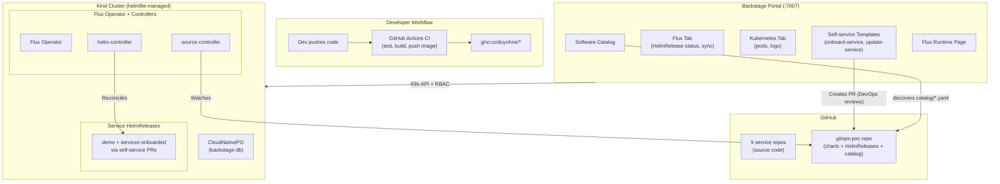
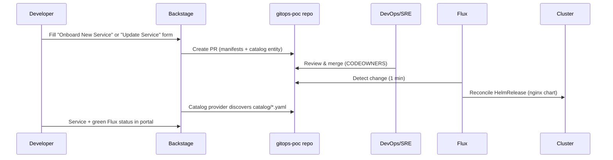

# Developer Platform (Backstage)

Internal Developer Platform built with [Backstage](https://backstage.io) for the `duynhlab` microservices ecosystem.

Provides a unified portal for service catalog, Flux GitOps-based deployment, Kubernetes monitoring, software templates, and TechDocs -- all driven by YAML configuration.

## Architecture



## Developer Self-Service Flow

Devs onboard and update services themselves; DevOps/SRE only review and approve PRs.



## Prerequisites

- **Node.js** 22 or 24
- **Yarn** 4.4.1 (included via `.yarnrc.yml`)
- **Docker** (for building production image)
- **GitHub Personal Access Token** with `repo` scope

## Quick Start (Local Development)

```bash
# 1. Clone
git clone https://github.com/duynhlab/backstage.git
cd backstage

# 2. Set GitHub token
export GITHUB_TOKEN=ghp_your_token_here

# 3. Install dependencies
corepack enable
corepack yarn install

# 4. Start dev server (frontend :3000, backend :7007)
corepack yarn start
```

> **Linux Users**: If `yarn install` fails, prefix commands with `corepack` to ensure Yarn 4.x is used.

Open http://localhost:3000 in your browser. Local development uses **SQLite in-memory** database.

## Deploy to Kind Cluster (Production-like)

The whole stack — Flux Operator + FluxInstance (syncing
[duynhlab/gitops-poc](https://github.com/duynhlab/gitops-poc)), CloudNativePG,
the Backstage database (CNPG `Cluster`), and Backstage itself — is declared in
[`deploy/helmfile.yaml.gotmpl`](deploy/helmfile.yaml.gotmpl).

```bash
# One command: Kind cluster + image build + helmfile apply
./deploy/setup.sh

# Open http://localhost:7007 (Kind maps NodePort 30007 → host 7007)
```

See [deploy/README.md](deploy/README.md) for details and the manual steps.

## Available Scripts

| Command | Description |
|---------|-------------|
| `corepack yarn start` | Start frontend + backend in development mode |
| `corepack yarn tsc` | TypeScript type check |
| `corepack yarn build:backend` | Build backend for production |
| `corepack yarn build:all` | Build all packages |
| `corepack yarn build-image` | Build Docker image (run `build:backend` first) |
| `corepack yarn test` | Run tests |
| `corepack yarn lint:all` | Lint all packages |
| `corepack yarn clean` | Clean build artifacts |

## Installed Plugins

| Plugin | Package | Purpose |
|--------|---------|---------|
| Software Catalog | `@backstage/plugin-catalog` | Service registry from catalog YAML |
| Kubernetes | `@backstage/plugin-kubernetes` | Pod status, logs, events per service |
| Flux | `@backstage-community/plugin-flux` | HelmRelease status, Sync/Suspend, OCI sources |
| Software Templates | `@backstage/plugin-scaffolder` | Create services + deploy via UI form |
| TechDocs | `@backstage/plugin-techdocs` | Docs rendered from markdown in service repos |
| Search | `@backstage/plugin-search` | Full-text search across catalog and docs |

## Project Structure

```
backstage/
├── app-config.yaml                 # Dev config (SQLite, localhost)
├── app-config.production.yaml      # Production config (PostgreSQL, K8s)
├── catalog/                        # Catalog entities (single-repo approach)
│   ├── systems/ecommerce.yaml      # System definition
│   ├── components/                 # 1 file per service (9 total)
│   │   ├── auth.yaml
│   │   ├── user.yaml
│   │   ├── product.yaml
│   │   ├── cart.yaml
│   │   ├── order.yaml
│   │   ├── review.yaml
│   │   ├── notification.yaml
│   │   ├── shipping.yaml
│   │   └── frontend.yaml
│   └── org/platform-team.yaml      # Group + User entities
├── templates/                      # Scaffolder templates (self-service via PR)
│   ├── onboard-service/            # New service → PR to gitops-poc
│   └── update-service/             # Change image/env/replicas → PR to gitops-poc
├── packages/
│   ├── app/                        # Frontend (React)
│   │   └── src/
│   │       ├── App.tsx             # Routes (Flux runtime, deploy)
│   │       └── components/
│   │           ├── Root/Root.tsx   # Sidebar navigation
│   │           └── catalog/
│   │               └── EntityPage.tsx  # Entity tabs (K8s, Flux)
│   └── backend/                    # Backend (Node.js)
│       ├── src/index.ts            # Plugin registration
│       └── Dockerfile              # Production image
├── deploy/                         # Kind + helmfile deployment
│   ├── helmfile.yaml.gotmpl        # Full stack: flux, cnpg, backstage-db, backstage
│   ├── kind-config.yaml            # Kind cluster (NodePort 30007 → host 7007)
│   ├── setup.sh                    # One-command bootstrap
│   └── charts/                     # Local charts: backstage, backstage-db (CNPG)
├── docs/                           # Documentation
│   └── flux-integration.md         # Dev team Flux guide
├── examples/                       # Backstage default examples
└── .github/workflows/ci.yml        # CI: build + push to GHCR
```

## Configuration

### Environment Variables

| Variable | Required | Description |
|----------|----------|-------------|
| `GITHUB_TOKEN` | Yes | GitHub PAT with `repo` scope (scaffolder PRs + catalog discovery). In the Kind deploy, `setup.sh` takes it from `gh auth token`. |
| `POSTGRES_*` | Production | Injected automatically by the `backstage` chart from the CNPG `backstage-db-app` secret. |

### Catalog Sources

All catalog entities live in `catalog/` (single-repo approach). Configured in `app-config.yaml` / `app-config.production.yaml`:

- **9 microservices**: individual YAML files in `catalog/components/`
- **System**: `catalog/systems/ecommerce.yaml`
- **Organization**: `catalog/org/platform-team.yaml`
- **Software Templates**: `templates/onboard-service/`, `templates/update-service/`
- **Self-service services**: auto-discovered from `catalog/*.yaml` in
  [duynhlab/gitops-poc](https://github.com/duynhlab/gitops-poc) (GitHub entity provider, 1m refresh)

Each component maps to a HelmRelease via the `backstage.io/kubernetes-id` annotation —
the 9 microservices live in `duynhlab/homelab`, POC self-service services in `duynhlab/gitops-poc`.

### Flux Integration

See [docs/flux-integration.md](docs/flux-integration.md) for the full dev team guide including:
- How to add Kubernetes/Flux annotations to your service
- How to label HelmReleases for Backstage discovery
- How to use the Deploy Service template

## CI/CD

GitHub Actions workflow (`.github/workflows/ci.yml`) on push/PR to `main`:

1. `yarn install --immutable`
2. `yarn tsc` - Type check
3. `yarn build:backend` - Build backend
4. Build + push Docker image to `ghcr.io/duynhlab/backstage/backstage` (on merge to `main`)

## Related Repositories

| Repository | Purpose |
|------------|---------|
| [duynhlab/gitops-poc](https://github.com/duynhlab/gitops-poc) | POC GitOps repo — self-service PRs land here (nginx chart, HelmReleases, catalog) |
| [duynhlab/homelab](https://github.com/duynhlab/homelab) | GitOps manifests (HelmReleases, infra, Flux config) |
| [duynhlab/auth-service](https://github.com/duynhlab/auth-service) | Auth microservice |
| [duynhlab/user-service](https://github.com/duynhlab/user-service) | User microservice |
| [duynhlab/product-service](https://github.com/duynhlab/product-service) | Product microservice |
| [duynhlab/cart-service](https://github.com/duynhlab/cart-service) | Cart microservice |
| [duynhlab/order-service](https://github.com/duynhlab/order-service) | Order microservice |
| [duynhlab/review-service](https://github.com/duynhlab/review-service) | Review microservice |
| [duynhlab/notification-service](https://github.com/duynhlab/notification-service) | Notification microservice |
| [duynhlab/shipping-service](https://github.com/duynhlab/shipping-service) | Shipping microservice |
| [duynhlab/frontend](https://github.com/duynhlab/frontend) | Frontend web application |
