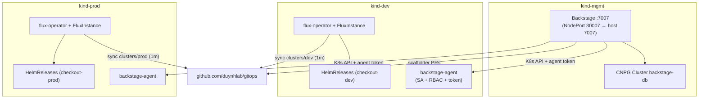

# Deployment Guide

Three Kind clusters, one helmfile. The mgmt cluster hosts the platform;
each environment cluster runs its own Flux.

## Topology

| Cluster | Runs | Managed by |
|---------|------|-----------|
| `kind-mgmt` | Backstage (:7007 via NodePort 30007) + CloudNativePG `backstage-db` | helmfile (`tier=mgmt`) |
| `kind-dev` | flux-operator + FluxInstance (syncs `clusters/dev`) + backstage-agent | helmfile (`tier=env`), workloads by Flux |
| `kind-prod` | flux-operator + FluxInstance (syncs `clusters/prod`) + backstage-agent | helmfile (`tier=env`), workloads by Flux |



Backstage reaches the environment clusters over the shared `kind` docker
network (`https://<node-ip>:6443`), authenticating with the long-lived
`backstage-agent` ServiceAccount token that `setup.sh` extracts and injects
as `K8S_DEV_URL/TOKEN` and `K8S_PROD_URL/TOKEN`.

## Prerequisites

Docker, Kind, kubectl, Helm v3+, helmfile v1+, Node 22/24, `gh` CLI
authenticated with an account that can open PRs against `duynhlab/gitops`.

## Quick start

```bash
./deploy/setup.sh
# Backstage at http://localhost:7007 (guest sign-in)
```

The script: creates the three Kind clusters → builds + loads the Backstage
image into mgmt → `helmfile apply -l tier=env` (Flux + agent on dev/prod) →
extracts agent endpoints/tokens → `helmfile apply -l tier=mgmt` (CNPG +
Backstage). Already built the image? `SKIP_BUILD=1 ./deploy/setup.sh`

### Enable Flux image automation (GitHub App)

Image automation needs git-write credentials. Export the `duynhlab/gitops`
GitHub App before running setup — the App ID and Installation ID are not
secrets; only the private key is (kept out of the repo, referenced by path):

```bash
export GITOPS_APP_ID=4244512
export GITOPS_APP_INSTALLATION_ID=145150800
export GITOPS_APP_PEM_PATH=~/.secrets/duynhlab-gitops.20260707.private-key.pem
./deploy/setup.sh
```

Without these, everything still deploys — image automation just reconciles
read-only (no auto-commit / no promote PRs). App owned by `@duynhne`, client id
`Iv23likOXOvWc4D4NH72`, installed on `duynhlab/gitops` with Contents: RW.

## Verify

```bash
kind get clusters                                   # mgmt, dev, prod
kubectl --context kind-dev  -n flux-system get fluxinstance,gitrepository,kustomization
kubectl --context kind-prod -n flux-system get fluxinstance,gitrepository,kustomization
kubectl --context kind-mgmt -n backstage get cluster,pods
kubectl --context kind-dev  get helmrelease -A
curl -s http://localhost:7007/healthcheck
```

## File structure

```
deploy/
├── helmfile.yaml.gotmpl       # All three clusters (kubeContext per release, tier labels)
├── kind-mgmt.yaml             # mgmt cluster, NodePort 30007 → host 7007
├── kind-dev.yaml              # dev environment cluster
├── kind-prod.yaml             # prod environment cluster
├── setup.sh                   # One-command bootstrap (env tier → tokens → mgmt tier)
└── charts/
    ├── backstage/             # Deployment, Service, SA, Secret (mgmt)
    ├── backstage-db/          # CNPG Cluster CR (mgmt)
    └── backstage-agent/       # SA + RBAC + token on each env cluster
```

## RBAC (chart `deploy/charts/backstage-agent`, per env cluster)

| ClusterRole | Purpose | Verbs |
|-------------|---------|-------|
| `backstage-agent-k8s-read` | Kubernetes plugin (pods, logs, deployments, …) | get, list, watch |
| `flux-view-flux-system` (created by Flux) | Read Flux CRDs | get, list, watch |
| `backstage-agent-flux-patch` | Flux plugin Sync/Suspend buttons | patch |

## Why `backstage-agent` — and is it optional?

Backstage is a **read-only portal on the mgmt cluster**, not part of the
delivery path. Three planes are in play:

- **Data plane** — the `checkout` pods serving traffic on dev/prod.
- **Delivery control plane** — Flux on *each* env cluster, pulling from git
  independently (decentralized; Backstage being down never stops a deploy).
- **Portal / management plane** — Backstage, a window that stitches together
  the catalog, CI/CD, and live cluster state.

Backstage draws from three sources, and **only one needs cluster credentials**:

| Source | Powers | Needs an agent SA? |
|--------|--------|--------------------|
| GitHub (gitops repo) | Software Catalog | No |
| GitHub Actions API | CI/CD tab | No |
| **Each cluster's kube-apiserver (live)** | **Kubernetes tab + Flux tab** | **Yes** |

The Kubernetes plugin is a **fan-out aggregator**: it has no datastore of its
own, so every time a Kubernetes/Flux tab renders it calls each cluster's API
server directly and merges the results. That is the *only* reason a token per
cluster exists. Each cluster is a separate API server with its own auth, hence
one `serviceAccountToken` per cluster in `app-config.production.yaml`
(`clusterLocatorMethods`).

This is the same **hub-and-spoke** shape as `argocd cluster add` (a
ServiceAccount + token on each spoke, stored on the hub), with two deliberate
differences: the agent is **read-only** (Argo's `argocd-manager` is
cluster-admin because it deploys), and it sits **off the delivery path** (Flux
pulls; the hub only observes).

**It is optional.** Drop the Kubernetes + Flux tabs and Backstage needs zero
cluster access — the catalog and CI/CD tab still work. Trade-off: you'd inspect
live state via the Flux Web UI (`:9080`), `kubectl`, or the MCP server per
cluster instead of one unified per-service view. Recommended middle ground for
real environments: keep the agent on **prod as read-only** (drop the
`backstage-agent-flux-patch` ClusterRole/binding — nobody should Sync/Suspend
prod from a portal), keep patch on dev only.

> Token note: `backstage-agent-token` is a non-expiring
> `kubernetes.io/service-account-token` — fine for local Kind, but for a real
> deployment move to short-lived TokenRequest tokens or per-cluster OIDC
> (Argo CD has the same limitation and is migrating the same way).

## Flux Operator extras (per env cluster)

Flux is installed and lifecycle-managed by the
[Flux Operator](https://fluxoperator.dev/get-started/) — no `flux bootstrap`.

- **Status page (Web UI)**:
  ```bash
  kubectl --context kind-dev -n flux-system port-forward svc/flux-operator 9080:9080
  # http://localhost:9080
  ```
- **Cluster report**: `kubectl --context kind-dev -n flux-system get fluxreport/flux -o yaml`
- **MCP server**: `brew install controlplaneio-fluxcd/tap/flux-operator-mcp`
  (or a [release binary](https://github.com/controlplaneio-fluxcd/flux-operator/releases)),
  then register `flux-operator-mcp serve` in your assistant's MCP settings.

## Iterating on the Backstage app

```bash
corepack yarn tsc && corepack yarn build:backend && corepack yarn build-image
kind load docker-image backstage:latest --name mgmt
kubectl --context kind-mgmt -n backstage rollout restart deployment/backstage
```

Template-only changes also require this loop (templates are baked into the image).

## Stop / resume / teardown

```bash
# stop (state kept on the container disks)
docker stop mgmt-control-plane dev-control-plane prod-control-plane
# resume — pods return in ~1-2 min; env-cluster IPs can change on restart,
# re-run steps 4-5 of setup.sh (or the whole script) if Backstage loses the clusters
docker start mgmt-control-plane dev-control-plane prod-control-plane

# teardown
kind delete clusters mgmt dev prod
```
