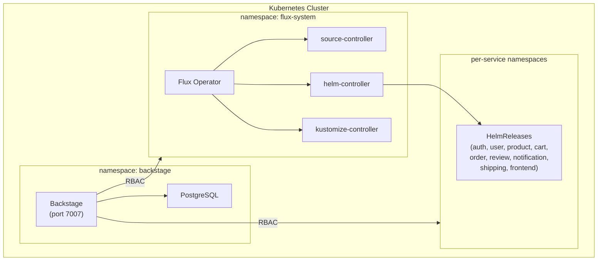

# Deployment Guide

Production-ready deployment of Backstage + Flux Operator on Kubernetes.

## Architecture



## Prerequisites

- Docker
- Kind (v0.20+)
- Helm (v3+)
- kubectl

## Quick Start (Kind)

```bash
# One-command setup
./deploy/overlays/kind/setup.sh
```

Or step by step:

### 1. Create Kind Cluster

```bash
kind create cluster --config deploy/overlays/kind/kind-config.yaml
```

### 2. Deploy PostgreSQL

```bash
helm install postgresql oci://registry-1.docker.io/bitnamicharts/postgresql \
  --namespace backstage --create-namespace \
  --set auth.postgresPassword=backstage \
  --set auth.database=backstage
```

### 3. Install Flux Operator

```bash
helm install flux-operator \
  oci://ghcr.io/controlplaneio-fluxcd/charts/flux-operator \
  --namespace flux-system --create-namespace

kubectl apply -f deploy/flux/flux-instance.yaml
kubectl apply -f deploy/flux/rbac.yaml
```

### 4. Build and Load Backstage Image

```bash
corepack yarn install
corepack yarn tsc
corepack yarn build:backend
corepack yarn build-image
kind load docker-image backstage --name backstage-dev
```

### 5. Create Secrets

```bash
cp deploy/base/secret.yaml.example deploy/base/secret.yaml
# Edit deploy/base/secret.yaml with your GITHUB_TOKEN
kubectl apply -f deploy/base/secret.yaml
```

### 6. Deploy Backstage

```bash
kubectl apply -k deploy/base/
```

### 7. Access Backstage

```bash
kubectl port-forward -n backstage svc/backstage 7007:7007
# Open http://localhost:7007
```

## Verify

```bash
# Check all pods
kubectl get pods -A

# Check Flux status
kubectl -n flux-system get fluxinstance
kubectl -n flux-system get pods

# Check Backstage
kubectl -n backstage get pods
kubectl -n backstage logs deployment/backstage --tail=20

# Check HelmReleases
kubectl get helmrelease -A
```

## File Structure

```
deploy/
├── overlays/
│   └── kind/
│       ├── kind-config.yaml       # Kind cluster with NodePort 30007
│       └── setup.sh               # One-command full setup
├── base/
│   ├── kustomization.yaml         # Kustomize base
│   ├── namespace.yaml             # backstage namespace
│   ├── serviceaccount.yaml        # backstage SA (used for K8s/Flux RBAC)
│   ├── deployment.yaml            # Backstage pod with PostgreSQL env vars
│   ├── service.yaml               # NodePort service on 30007
│   └── secret.yaml.example        # Template for GITHUB_TOKEN and PG password
└── flux/
    ├── flux-instance.yaml         # FluxInstance CRD (installs Flux controllers)
    └── rbac.yaml                  # RBAC: flux-view + patch-flux-resources
```

## RBAC Explained

| ClusterRole | Purpose | Verbs |
|-------------|---------|-------|
| `flux-view-flux-system` | Read Flux CRDs (created by Flux) | get, list, watch |
| `backstage-flux-patch` | Sync/suspend HelmReleases, Kustomizations | patch |

Both are bound to the `backstage` ServiceAccount in the `backstage` namespace.

## Production Considerations

- Replace Kind with production cluster (EKS, GKE, AKS, etc.)
- Use external PostgreSQL (RDS, Cloud SQL, etc.)
- Configure proper TLS/ingress for Backstage
- Replace guest auth with GitHub/OIDC auth provider
- Use external secret management (Vault, External Secrets Operator)
- Set proper resource limits in deployment.yaml
- Enable PostgreSQL backups

## Teardown

```bash
kind delete cluster --name backstage-dev
```
