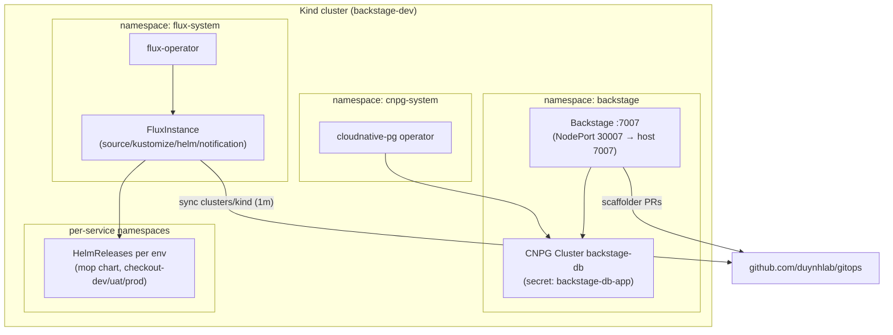

# Deployment Guide

Everything is declared in **one helmfile** and installed into a local **Kind** cluster.

## Stack

| Release | Chart | Namespace | Purpose |
|---------|-------|-----------|---------|
| flux-operator | `oci://ghcr.io/controlplaneio-fluxcd/charts/flux-operator` | flux-system | Manages the Flux distribution |
| flux | `oci://ghcr.io/controlplaneio-fluxcd/charts/flux-instance` | flux-system | Installs Flux controllers, syncs [duynhlab/gitops](https://github.com/duynhlab/gitops) (`clusters/kind`) |
| cloudnative-pg | `cnpg/cloudnative-pg` | cnpg-system | PostgreSQL operator |
| backstage-db | `./charts/backstage-db` (local) | backstage | CNPG `Cluster` CR — PostgreSQL for Backstage |
| backstage | `./charts/backstage` (local) | backstage | The portal itself (locally built image) |



## Prerequisites

Docker, Kind, kubectl, Helm v3+, helmfile v1+, Node 22/24, `gh` CLI authenticated
with an account that can open PRs against `duynhlab/gitops`.

## Quick start

```bash
./deploy/setup.sh
# Backstage at http://localhost:7007 (guest sign-in)
```

The script: creates the Kind cluster → builds + loads the Backstage image →
`helmfile apply` (uses `GITHUB_TOKEN` from env, falling back to `gh auth token`).

Already built the image? `SKIP_BUILD=1 ./deploy/setup.sh`

Manual equivalent:

```bash
kind create cluster --config deploy/kind-config.yaml
corepack yarn install && corepack yarn tsc && corepack yarn build:backend && corepack yarn build-image
kind load docker-image backstage:latest --name backstage-dev
GITHUB_TOKEN=$(gh auth token) helmfile -f deploy/helmfile.yaml.gotmpl apply
```

## Verify

```bash
kubectl get pods -A
kubectl -n flux-system get fluxinstance,gitrepository,kustomization
kubectl -n backstage get cluster            # CNPG: "Cluster in healthy state"
kubectl get helmrelease -A                  # demo (+ onboarded services)
curl -s http://localhost:7007/healthcheck
```

## Flux Operator extras

Flux is installed and lifecycle-managed by the
[Flux Operator](https://fluxoperator.dev/get-started/) — the `FluxInstance` CR
in the helmfile defines the distribution (version `2.x`, components incl.
`source-watcher`, `cluster.size: small` for Kind) and the sync to
`duynhlab/gitops`. Upgrading Flux = the operator reconciling a new manifest
digest; no `flux bootstrap`.

- **Status page (Web UI)** — built into the operator:
  ```bash
  kubectl -n flux-system port-forward svc/flux-operator 9080:9080
  # http://localhost:9080 — pipelines, sources, reconciliation status
  ```
- **Cluster report**:
  ```bash
  kubectl -n flux-system get fluxreport/flux -o yaml
  ```
- **MCP server** (Agentic GitOps — lets an AI assistant inspect/debug Flux):
  ```bash
  brew install controlplaneio-fluxcd/tap/flux-operator-mcp
  # or download a release binary: https://github.com/controlplaneio-fluxcd/flux-operator/releases
  # then register `flux-operator-mcp serve` in your assistant's MCP settings
  ```

## Resuming a stopped cluster

The Kind container can be stopped/started without losing state:

```bash
docker stop backstage-dev-control-plane     # stop (state kept on the container disk)
docker start backstage-dev-control-plane    # resume — pods return in ~1-2 min
```

## File structure

```
deploy/
├── helmfile.yaml.gotmpl     # The whole stack, declaratively
├── kind-config.yaml         # Kind cluster, NodePort 30007 → host 7007
├── setup.sh                 # One-command bootstrap
└── charts/
    ├── backstage/           # Deployment, Service, SA, RBAC, github-token Secret
    └── backstage-db/        # CNPG Cluster CR (db: backstage, owner has CREATEDB)
```

## RBAC (chart `deploy/charts/backstage`)

| ClusterRole | Purpose | Verbs |
|-------------|---------|-------|
| `backstage-k8s-read` | Kubernetes plugin (pods, logs, deployments, …) | get, list, watch |
| `flux-view-flux-system` (created by Flux) | Read Flux CRDs | get, list, watch |
| `backstage-flux-patch` | Flux plugin Sync/Suspend buttons | patch |

## Iterating on the Backstage app

```bash
corepack yarn tsc && corepack yarn build:backend && corepack yarn build-image
kind load docker-image backstage:latest --name backstage-dev
kubectl -n backstage rollout restart deployment/backstage
```

Template-only changes also require this loop (templates are baked into the image).

## Teardown

```bash
kind delete cluster --name backstage-dev
```
