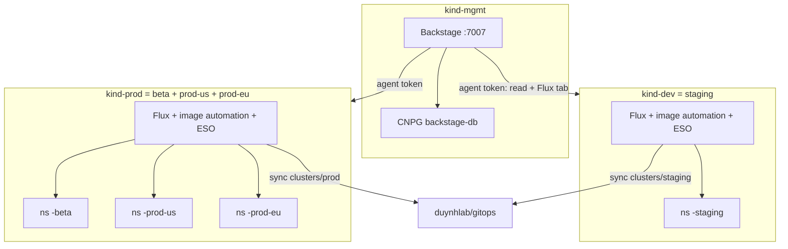
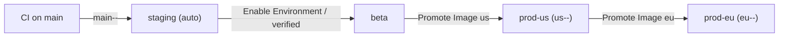

# Environments & Promotion

Four environments across **two Kind clusters**; a service starts in staging
only and is promoted outward on demand.

| Env | Cluster | Namespace | ENV (app) | LOG_LEVEL | How it updates |
|-----|---------|-----------|-----------|-----------|----------------|
| staging | `kind-dev` | `<svc>-staging` | staging | debug | CI builds `main-<n>-<sha>` → Flux image automation commits to `main` (auto) |
| beta | `kind-prod` | `<svc>-beta` | staging | info | Enable Environment PR; image automation → reviewed PR |
| prod-us | `kind-prod` | `<svc>-prod-us` | production | warn | Promote Image (us) → image automation → reviewed PR |
| prod-eu | `kind-prod` | `<svc>-prod-eu` | production | warn | Promote Image (eu) → image automation → reviewed PR |

> The app's config only accepts ENV ∈ {…,staging,…,production,…}, so beta maps
> to `staging` and the prod regions to `production` at the app level, while the
> platform still treats them as distinct environments/namespaces.

## Topology



## Self-service templates

| Template | Does | Review |
|----------|------|--------|
| **Onboard New Service** | Adds a service to **staging** (base + staging values, HelmRelease, SecretStore/ExternalSecret, image automation, registry, catalog) | none (staging unowned) |
| **Update Env Var** | Surgically sets one `env:` entry in `values-<env>.yaml` | staging none; beta/prod-* required |
| **Enable Environment** | Adds a beta / prod-us / prod-eu overlay + Flux wiring for an existing service | required |
| **Promote Image to Region** | Re-tags a verified image us→eu (registry only); Flux then opens a reviewed PR | via the resulting PR |

## Values model

Each env's `HelmRelease` reads `values-base.yaml` then `values-<env>.yaml`
(two `configMapGenerator` ConfigMaps via `valuesFrom`, later wins). The env
file holds image tag + replicas + the full env-var contract and is the single
source of truth for that environment.

## Image promotion (tags, not rebuilds)



Region prefixes (`main-`/`us-`/`eu-`) let each environment's ImagePolicy track
exactly the tags meant for it; promotion re-tags an existing image (same
`<n>-<sha>`), never rebuilds.

## Rollback

Re-run **Update Env Var** or revert the gitops commit for that env's
`values-<env>.yaml`; `git log apps/prod-eu/<svc>/` is the deployment history.

## Verify (when the clusters are up)

```bash
kubectl --context kind-dev  -n <svc>-staging  get pods,helmrelease,externalsecret
kubectl --context kind-prod -n <svc>-prod-eu  get pods,helmrelease
kubectl --context kind-dev  -n flux-system get imagepolicy,imageupdateautomation
```
