# Environments & Promotion

The platform runs three environments. Today they are namespaces on one Kind
cluster; the GitOps layout already separates them completely, so moving to
per-environment clusters only means pointing each cluster's FluxInstance at its
own `clusters/<name>` path in [duynhlab/gitops](https://github.com/duynhlab/gitops).

## The model

| Env | Namespace | ENV | LOG_LEVEL | Replicas | OTEL_SAMPLE_RATE | Who updates it |
|-----|-----------|-----|-----------|----------|------------------|----------------|
| dev | `<svc>-dev` | development | debug | 1 | 1.0 | **Service CI** — auto-commit on every merge to main |
| uat | `<svc>-uat` | staging | info | 2 | 0.5 | **Backstage PR** + DevOps review |
| prod | `<svc>-prod` | production | warn | 2 | 0.1 | **Backstage PR** + DevOps review |

Each environment owns one file per service —
`apps/<env>/<svc>/release-patch.yaml` — containing the image tag, replicas and
the **complete env var contract**. That file is the full desired state: a PR
diff against it is everything that will change.

## Promotion pipeline

```mermaid
flowchart LR
    Merge["Merge code PR\n(service repo)"] --> Build["CI: build + scan + sign\nghcr sha-X (immutable)"]
    Build -->|"auto-commit"| Dev["dev\nruns sha-X"]
    Dev -->|"verified?\nBackstage Update/Promote\nenv=uat, tag=sha-X"| PRU["PR → DevOps review"]
    PRU -->|merge| Uat["uat\nruns sha-X"]
    Uat -->|"verified?\nsame template, env=prod"| PRP["PR → DevOps review"]
    PRP -->|merge| Prod["prod\nruns sha-X"]
```



Rules that make this safe:

- **Images are immutable** (`sha-<short>` per commit, `X.Y.Z` on tags, no
  `latest`). Promotion moves a tag through env files — the artifact never changes.
- **One PR touches one environment.** The Update/Promote template only writes
  `apps/<env>/<svc>/release-patch.yaml`.
- **dev is the only push lane.** CI (holding a scoped token) commits tag bumps
  to `apps/dev` directly; branch protection requires review for everything else.

## Rollback

Rollback = promotion in reverse, same mechanics:

1. **Fast:** run **Update / Promote Service** with the previous known-good tag
   (find it in the env file's git history) → PR → merge → Flux rolls back.
2. **Git-native:** `git revert` the offending commit in `duynhlab/gitops` → PR → merge.

Because every change is a commit in one repo, `git log apps/prod/checkout/`
is the complete deployment history of prod.

## Verifying an environment

```bash
flux get kustomizations -n flux-system            # apps-dev / apps-uat / apps-prod
kubectl -n checkout-uat get pods,helmrelease
kubectl -n checkout-uat port-forward svc/checkout 8080:8080
curl -s localhost:8080/api/v1/info | jq           # shows env, version, log level
```

Or in Backstage: the service's **Kubernetes** tab shows pods from all three
namespaces; the **Flux** tab shows the three HelmReleases and their revisions.
