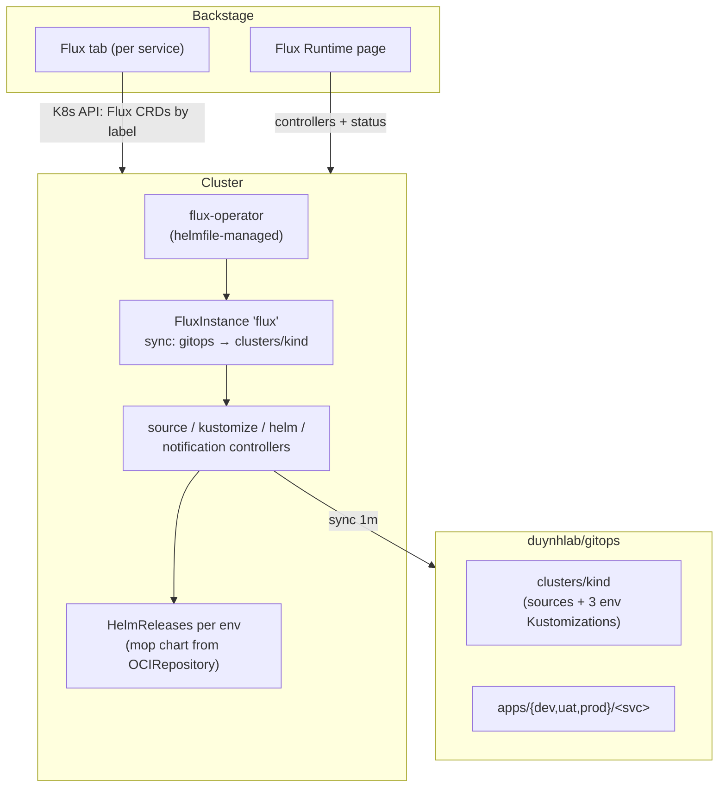

# Flux Integration

How Backstage and Flux are wired together on this platform.

## Moving parts

- Flux itself is installed by the **Flux Operator** via helmfile
  (`deploy/helmfile.yaml.gotmpl`); the **FluxInstance** defines the
  distribution and the sync target (`duynhlab/gitops`, path `clusters/kind`).
- Backstage talks to the Kubernetes API with its ServiceAccount:
  `flux-view-flux-system` (read Flux CRDs), `backstage-k8s-read` (workloads),
  `backstage-flux-patch` (Sync/Suspend buttons).

## How entity ↔ resource matching works

Two annotations on the catalog entity (both set by the onboarding template):

| Annotation | Used by | Matches |
|------------|---------|---------|
| `backstage.io/kubernetes-label-selector: app.kubernetes.io/name=<svc>` | Kubernetes tab | Workload labels rendered by the mop chart — pods from **all** environments |
| `backstage.io/kubernetes-id: <svc>` | Flux tab | The `backstage.io/kubernetes-id` label on each HelmRelease |

## Useful views

- **Service page → Flux tab**: the three HelmReleases (dev/uat/prod), applied
  chart version and revision, Sync / Suspend / Resume buttons
- **Service page → Kubernetes tab**: pods, logs and events across
  `<svc>-dev/uat/prod`
- **Sidebar → Flux Runtime**: controller health and versions cluster-wide

## Troubleshooting

| Symptom | Check |
|---------|-------|
| Flux tab: "No resources found" | HelmRelease label `backstage.io/kubernetes-id` must equal the entity annotation |
| HelmRelease Failed | `kubectl -n flux-system logs deploy/helm-controller`; `kubectl -n <ns> describe helmrelease <svc>` |
| Sync button does nothing | `backstage-flux-patch` ClusterRoleBinding applied? (part of the backstage chart) |
| Nothing syncs at all | `kubectl -n flux-system get fluxinstance,gitrepository,kustomization` |
