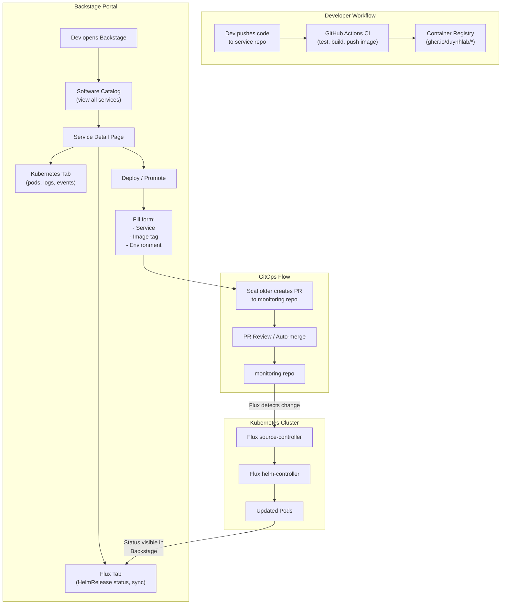
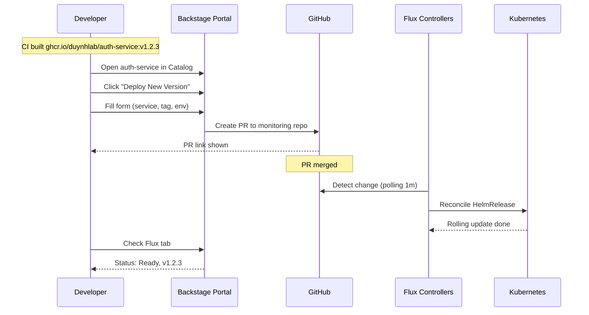
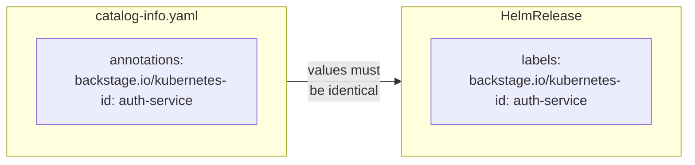
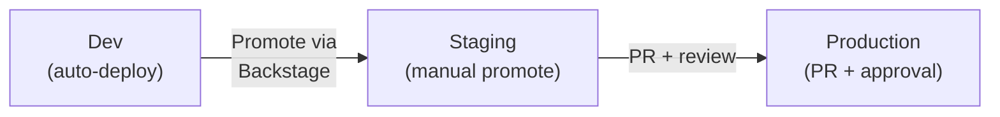

# Flux Integration Guide for Dev Team

This guide explains how Backstage integrates with Flux Operator to provide GitOps-based deployment visibility and self-service deploy for the duynhlab microservices ecosystem.

## How It Works



## Deploy Sequence



## Setting Up Your Service

### Step 1: Add Annotations to catalog-info.yaml

In your service repo (e.g. `duynhlab/auth-service`), add these annotations to `catalog-info.yaml`:

```yaml
apiVersion: backstage.io/v1alpha1
kind: Component
metadata:
  name: auth-service
  annotations:
    # REQUIRED: matches the label on your HelmRelease
    backstage.io/kubernetes-id: auth-service
    # OPTIONAL: restrict to specific namespace
    backstage.io/kubernetes-namespace: apps
spec:
  type: service
  lifecycle: production
  owner: platform-team
  system: duynhlab-ecommerce
```

### Step 2: Add Labels to HelmRelease

In the `duynhlab/monitoring` repo, ensure your HelmRelease has the matching label:

```yaml
apiVersion: helm.toolkit.fluxcd.io/v2
kind: HelmRelease
metadata:
  name: auth-service
  namespace: apps
  labels:
    # MUST match the annotation value in catalog-info.yaml
    backstage.io/kubernetes-id: auth-service
spec:
  interval: 5m
  chart:
    spec:
      chart: ./charts/auth-service
      sourceRef:
        kind: GitRepository
        name: monitoring
  values:
    image:
      repository: ghcr.io/duynhlab/auth-service
      tag: latest
```

### How Matching Works



Backstage reads the annotation from the catalog entity, then queries the Kubernetes API for all Flux CRDs (HelmRelease, Kustomization, GitRepository, etc.) that have a matching label. This is how the Flux tab shows the right resources for each service.

## Deploying a New Version

1. Open Backstage at `http://localhost:7007`
2. Navigate to your service in the **Software Catalog**
3. Click **Create...** in the sidebar
4. Select **Deploy Service** template
5. Fill in:
   - **Service Name**: select your service
   - **Image Tag**: the version to deploy (e.g. `v1.2.3`)
   - **Environment**: dev / staging / production
6. Click **Create**
7. Backstage creates a PR to the `duynhlab/monitoring` repo
8. Once the PR is merged, Flux automatically deploys the new version
9. Check the **Flux tab** on your service page to see the status

## Monitoring Flux Status

### Entity Page - Flux Tab

Each service page in Backstage has a **Flux** tab showing:
- **HelmReleases**: deployment status, version, last reconciliation time
- **Kustomizations**: applied manifests status
- **Sources**: GitRepository and OCIRepository sync status
- **Sync button**: force immediate reconciliation
- **Suspend/Resume**: temporarily pause deployments

### Flux Runtime Page

Access `/flux-runtime` from the sidebar to see cluster-wide Flux status:
- All Flux controllers and their versions
- Global reconciliation status

## Environment Promotion



| Environment | Deployment | Flux Interval | Approval |
|-------------|-----------|---------------|----------|
| Dev | Auto on merge | 1 minute | None |
| Staging | Manual via Backstage | 5 minutes | Team lead |
| Production | PR to main branch | 10 minutes | 2 reviewers |

## Troubleshooting

### Flux tab shows "No resources found"
- Verify `backstage.io/kubernetes-id` annotation exists in your `catalog-info.yaml`
- Verify the HelmRelease has a matching `backstage.io/kubernetes-id` label
- Check that Backstage ServiceAccount has RBAC permissions (`flux-view-flux-system`)

### HelmRelease shows "Failed"
- Check Flux logs: `kubectl -n flux-system logs deployment/helm-controller`
- Check the HelmRelease status: `kubectl -n apps describe helmrelease <name>`
- Verify the Helm chart exists and image is pullable

### Sync button does not work
- Verify `backstage-flux-patch` ClusterRole and ClusterRoleBinding are applied
- Check that the Backstage ServiceAccount has patch permissions

### Cannot access Kubernetes tab
- Verify `kubernetes` section exists in `app-config.yaml` / `app-config.production.yaml`
- Check the cluster URL and authentication method
