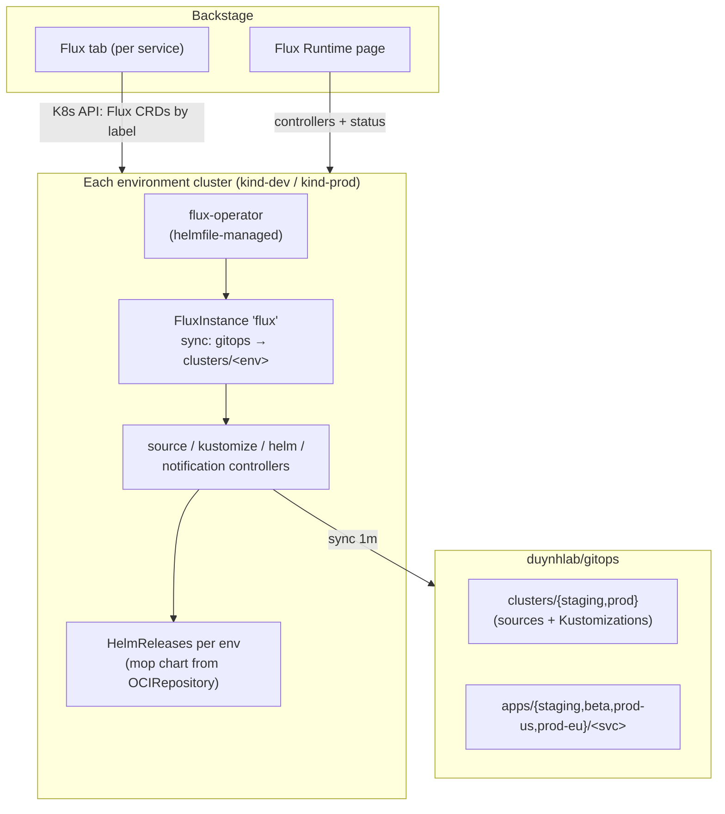

# Flux Integration

How Backstage and Flux are wired together on this platform.

## Moving parts

- Flux itself is installed by the **Flux Operator** via helmfile
  (`deploy/helmfile.yaml.gotmpl`); each environment cluster runs its own
  **FluxInstance** syncing `duynhlab/gitops` at `clusters/<env>`.
- Backstage (on kind-mgmt) talks to each environment cluster with the
  `backstage-agent` ServiceAccount token: `flux-view-flux-system` (read Flux
  CRDs), `backstage-agent-k8s-read` (workloads), `backstage-agent-flux-patch`
  (Sync/Suspend buttons). This live query is the *only* reason Backstage holds
  a per-cluster token — a hub-and-spoke pattern that is entirely optional. See
  [deploy/README.md → "Why `backstage-agent`"](../deploy/README.md#why-backstage-agent--and-is-it-optional)
  for the plane model, the Argo CD comparison, and the prod read-only option.

## How entity ↔ resource matching works

Two annotations on the catalog entity (both set by the onboarding template):

| Annotation | Used by | Matches |
|------------|---------|---------|
| `backstage.io/kubernetes-label-selector: app.kubernetes.io/name=<svc>` | Kubernetes tab | Workload labels rendered by the mop chart — pods from **all** environments |
| `backstage.io/kubernetes-id: <svc>` | Flux tab | The `backstage.io/kubernetes-id` label on each HelmRelease |

## Useful views

- **Service page → Flux tab**: the per-environment HelmReleases (staging/beta/prod-us/prod-eu), applied
  chart version and revision, Sync / Suspend / Resume buttons
- **Service page → Kubernetes tab**: pods, logs and events across
  `<svc>-staging` (kind-dev) and `<svc>-{beta,prod-us,prod-eu}` (kind-prod)
- **Sidebar → Flux Runtime**: controller health and versions cluster-wide

## Troubleshooting

| Symptom | Check |
|---------|-------|
| Flux tab: "No resources found" | HelmRelease label `backstage.io/kubernetes-id` must equal the entity annotation |
| HelmRelease Failed | `kubectl -n flux-system logs deploy/helm-controller`; `kubectl -n <ns> describe helmrelease <svc>` |
| Sync button does nothing | `backstage-flux-patch` ClusterRoleBinding applied? (part of the backstage chart) |
| Nothing syncs at all | `kubectl -n flux-system get fluxinstance,gitrepository,kustomization` |
