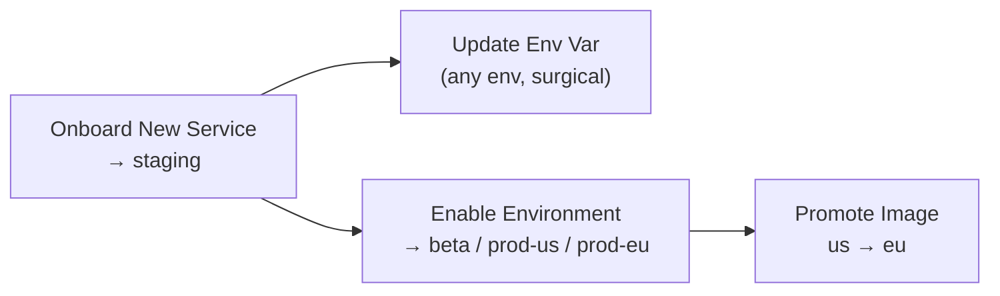

# Service Onboarding Guide

Get a service onto the platform and move it toward production — all from
Backstage, all as reviewed pull requests to
[duynhlab/gitops](https://github.com/duynhlab/gitops). You never push to gitops
by hand; DevOps/SRE review is enforced by CODEOWNERS on the higher environments.

## The four self-service templates



### 1. Onboard New Service → staging only

**Create…› Onboard New Service.** Fill name, owner, image tag, staging
replicas. One PR adds:

```
apps/base/<svc>/values-base.yaml           # env-invariant Helm values
apps/staging/<svc>/                         # namespace, HelmRelease, SecretStore,
                                            # ExternalSecret, values-staging.yaml, kustomization
clusters/staging/image-automation-<svc>.yaml
service-registry/<svc>.yaml
catalog/<svc>.yaml
```

Staging is unowned → merges without a required review. After merge, Flux on
`kind-dev` deploys `<svc>-staging`, and CI's `main-<n>-<sha>` builds
auto-update it thereafter.

### 2. Update Env Var (surgical)

**Create…› Update Env Var.** Pick service + environment + `KEY` + value. The
template fetches the current `values-<env>.yaml`, changes **only that one
`env:` entry**, and opens a PR. staging merges freely; beta/prod-* need review.

### 3. Enable Environment → beta / prod-us / prod-eu

**Create…› Enable Environment.** Pick service + target env + initial tag. One
PR adds the env overlay (`apps/<env>/<svc>/…`), its Flux Kustomization
(`clusters/prod/apps-<env>.yaml`) and image automation. Always reviewed.

### 4. Promote Image to Region — us → eu

**Create…› Promote Image.** Pick service + source tag + target region. Triggers
the service's `promote-region` workflow (registry re-tag only — no git write);
Flux then opens a `flux-image-prod-<region>` PR for review.

## Prerequisites for a new service repo

Follow [checkout-service](https://github.com/duynhlab/checkout-service): CI via
`gha-workflows`, image at `ghcr.io/duynhlab/<name>-service/<name>-service`,
`/health` `/ready` `/metrics` on :8080, env-driven config, and a
`main-<run>-<sha>` tag on main builds (so staging image automation can sort).

## For DevOps/SRE: reviewing

Every PR is machine-generated:

- **Onboard** — new files under `apps/base/<svc>`, `apps/staging/<svc>`,
  `clusters/staging`, `service-registry`, `catalog`. staging-only.
- **Update Env Var** — exactly one `values-<env>.yaml`, one `env:` entry changed.
- **Enable Environment** — a new `apps/<env>/<svc>` overlay + `clusters/prod`
  wiring. Check the region, replicas, tag.
- **Image automation PRs** (`flux-image-*` branches) — a single image tag bump.

```bash
gh pr diff <n> -R duynhlab/gitops
gh pr merge <n> -R duynhlab/gitops --squash --delete-branch
```

## Troubleshooting

| Symptom | Check |
|---------|-------|
| PR not created | Backstage task log — usually an expired `GITHUB_TOKEN` |
| Merged, not deployed | `kubectl --context kind-<dev\|prod> -n flux-system get kustomization`; `describe helmrelease <svc>` in the env namespace |
| Pod stuck (secret) | `kubectl -n <svc>-<env> get externalsecret` — the fake store must hold the requested key |
| staging not auto-updating | image automation needs a `main-<n>-<sha>` tag + the Flux GitHub App secret |
| Not in catalog | wait ~5 min (provider refresh); confirm `catalog/<svc>.yaml` on `main` |
