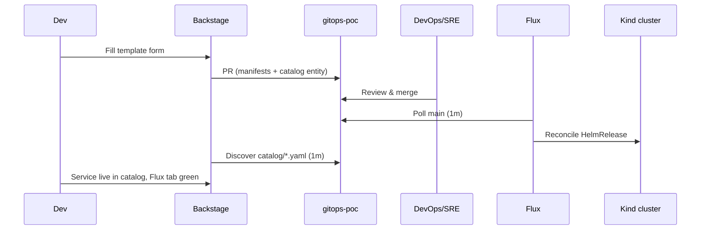

# Service Onboarding Guide

How to get your service running on the platform — **without asking DevOps/SRE to do it for you**.
You fill a form in Backstage; the platform opens a pull request; DevOps/SRE only review and approve.

## TL;DR

| I want to... | Template | What you get |
|--------------|----------|--------------|
| Run a new service | **Onboard New Service** | Namespace + HelmRelease + catalog entry, via one PR |
| Change image / env / replicas | **Update Service** | Updated HelmRelease, via one PR |

Nobody pushes to [duynhlab/gitops-poc](https://github.com/duynhlab/gitops-poc) directly.
Every change is a reviewed pull request; Flux applies whatever is on `main`.

## Prerequisites

- Backstage running at http://localhost:7007 (see [deploy/README.md](../deploy/README.md))
- Sign in as **Guest** (POC setup)

## Onboard a new service

1. Open **Backstage → Create...** (sidebar) → **Onboard New Service**
2. Fill **Service details**:
   - **Service name** — lowercase DNS-safe, e.g. `payment`. Becomes the namespace,
     the HelmRelease name, and the catalog entity name.
   - **Description** and **Owner** (your team)
3. Fill **Runtime configuration**:
   - **Image repository / tag** — defaults to `nginx:1.29-alpine` (the POC chart serves
     a landing page; any nginx-compatible image works)
   - **Replicas** (1–5)
   - **APP_ENV** — dev / staging / production
   - **APP_MESSAGE** — free text, shown on the service landing page
4. Click **Review → Create**
5. Open the **Pull Request** link from the output page and wait for DevOps/SRE approval

**What the PR contains** (rendered from your form, nothing hand-written):

```
apps/<name>/namespace.yaml     # Namespace
apps/<name>/release.yaml       # HelmRelease → shared chart charts/app
catalog/<name>.yaml            # Backstage Component entity
```

**After merge, automatically:**

- Flux detects the change within ~1 minute and deploys your service into namespace `<name>`
- Backstage discovers `catalog/<name>.yaml` within ~1 minute — your service appears
  in the Software Catalog with Kubernetes and Flux tabs wired up

**Verify:** open your service in the catalog → **Flux tab** shows the HelmRelease `Ready`,
**Kubernetes tab** shows the pods. Or:

```bash
kubectl -n <name> get pods,helmrelease
kubectl -n <name> port-forward svc/<name> 8080:80   # landing page on :8080
```

## Update a running service (image, env, replicas)

1. **Create...** → **Update Service (image / env / replicas)**
2. Pick your service from the catalog dropdown
3. Fill in the **full desired state** — the form replaces the current values,
   so set every field to what you want it to be (not just the one you're changing)
4. **Review → Create** → send the PR link to DevOps/SRE

After merge, Flux rolls out the change within ~1 minute. Env changes are visible
on the service landing page (`APP_ENV`, `APP_MESSAGE` are rendered into it).

## For DevOps/SRE: reviewing self-service PRs

You are the only gate between a dev form and the cluster. Every PR is machine-generated,
so review is fast:

- **Onboarding PRs** touch exactly three new files under `apps/<name>/` and `catalog/<name>.yaml`.
  Check: name doesn't collide, image source is acceptable, replicas/resources sane.
- **Update PRs** touch exactly one file: `apps/<name>/release.yaml`. The diff IS the change.
- Anything touching `charts/`, `clusters/`, or another service's directory did **not**
  come from a template — inspect carefully.

Merge = approve = deploy. No kubectl needed:

```bash
gh pr list -R duynhlab/gitops-poc
gh pr diff <n> -R duynhlab/gitops-poc
gh pr merge <n> -R duynhlab/gitops-poc --squash --delete-branch
```

To enforce reviews at the GitHub level (not enabled in the POC), see the
branch-protection command in the [gitops-poc README](https://github.com/duynhlab/gitops-poc#enforcing-review-optional-hardening).

## Troubleshooting

| Symptom | Check |
|---------|-------|
| PR not created after submitting the form | Task log in Backstage (**...** → task) — usually an expired `GITHUB_TOKEN` |
| Merged but service not deployed | `flux get kustomization apps -n flux-system` and `kubectl -n <name> describe helmrelease <name>` |
| Service deployed but not in catalog | Wait ~1 min (provider refresh), then check `catalog/<name>.yaml` merged on `main` |
| Flux tab empty on the entity page | `backstage.io/kubernetes-id` annotation must equal the HelmRelease label (templates set both) |

## How it works


