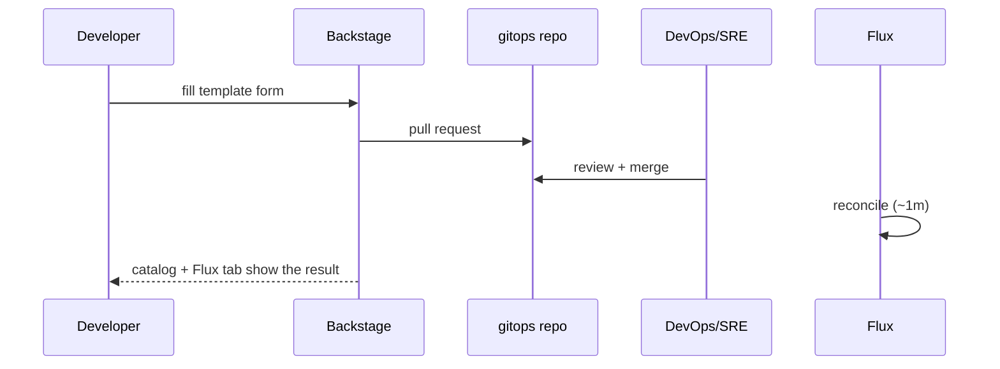

# Service Onboarding Guide

How to get your service running on the platform — **without asking DevOps/SRE
to do it for you**. You fill a form in Backstage; the platform opens a pull
request to [duynhlab/gitops](https://github.com/duynhlab/gitops); DevOps/SRE
review and merge; Flux does the rest.

## TL;DR

| I want to... | How | Result |
|--------------|-----|--------|
| Ship code to **dev** | Merge your code PR in the service repo | CI builds `sha-X`, bumps `apps/dev` automatically |
| Run a **new service** | Backstage → **Onboard New Service** | One PR: base + dev/uat/prod + catalog entity |
| **Promote / change** uat or prod | Backstage → **Update / Promote Service** | One PR touching one env file |

Nobody pushes to `duynhlab/gitops` by hand. Branch protection + CODEOWNERS
enforce DevOps/SRE review; the only automation lane is CI's dev tag bump.



## Prerequisites

- Backstage at http://localhost:7007 (see [deploy/README.md](../deploy/README.md)), guest sign-in
- Your service repo follows the org conventions (see
  [checkout-service](https://github.com/duynhlab/checkout-service)): CI via
  `gha-workflows`, image at `ghcr.io/duynhlab/<name>-service/<name>-service`,
  `/health` `/ready` `/metrics` on :8080, env-driven config

## Onboard a new service

1. **Create...** → **Onboard New Service**
2. Fill **Service details**: name (lowercase DNS-safe, e.g. `payment`),
   description, owner team
3. Fill **Image**: repository (empty = org convention) and the initial
   immutable tag from your CI (e.g. `sha-abc1234`)
4. Set **replicas per environment** (defaults: dev 1, uat 2, prod 2)
5. **Review → Create** → open the PR link and request DevOps/SRE review

The PR adds, for service `payment`:

```
apps/base/payment/                 # env-invariant HelmRelease (mop chart, probes, resources)
apps/dev/payment/                  # namespace payment-dev + full env contract, LOG_LEVEL=debug
apps/uat/payment/                  # namespace payment-uat, staging, LOG_LEVEL=info
apps/prod/payment/                 # namespace payment-prod, production, LOG_LEVEL=warn
catalog/payment.yaml               # Backstage entity (auto-discovered)
```

After merge: Flux deploys all three environments within ~1 minute and the
service appears in the catalog within ~5 minutes — no manual registration.

To wire **continuous dev deploys**, add the `update-gitops-dev` job to your
service's `build.yml` (copy from
[checkout-service](https://github.com/duynhlab/checkout-service/blob/main/.github/workflows/build.yml))
and set the `GITOPS_TOKEN` secret.

## Update or promote a service

1. **Create...** → **Update / Promote Service**
2. Pick the service and the **environment** (`uat`/`prod` for promotions;
   `dev` is normally CI-managed)
3. Fill the **full desired state**: image tag, replicas, LOG_LEVEL —
   the form replaces the env file, so set every field to what you want
4. **Review → Create** → send the PR to DevOps/SRE

Promotion is just this template with the tag that already ran in the lower
environment. See [environments.md](environments.md) for the full model and
rollback.

## For DevOps/SRE: reviewing self-service PRs

Every PR is machine-generated, so review is fast:

- **Onboarding PRs** add exactly: `apps/base/<name>/`, three env dirs and
  `catalog/<name>.yaml`. Check: name collision, image source, replicas sane.
- **Update PRs** touch exactly one file: `apps/<env>/<name>/release-patch.yaml`.
  The diff is the change. Verify the tag exists in ghcr and ran in the lower env.
- Anything touching `charts/`, `clusters/`, another service's directory, or
  `CODEOWNERS` did **not** come from a template — inspect carefully.

```bash
gh pr list -R duynhlab/gitops
gh pr diff <n> -R duynhlab/gitops
gh pr merge <n> -R duynhlab/gitops --squash --delete-branch
```

## Troubleshooting

| Symptom | Check |
|---------|-------|
| PR not created after submitting the form | Task log in Backstage — usually an expired `GITHUB_TOKEN` |
| Merged but not deployed | `flux get kustomization apps-<env> -n flux-system`, then `kubectl -n <svc>-<env> describe helmrelease <svc>` |
| Deployed but not in catalog | Wait ~5 min (provider refresh), confirm `catalog/<svc>.yaml` merged on main |
| Kubernetes tab empty | Entity needs `backstage.io/kubernetes-label-selector: app.kubernetes.io/name=<svc>` (the template sets it) |
| Flux tab empty | HelmRelease needs the `backstage.io/kubernetes-id: <svc>` label (the template sets it) |
| dev not auto-updating | `GITOPS_TOKEN` secret missing/expired in the service repo, or the `update-gitops-dev` job failed |
